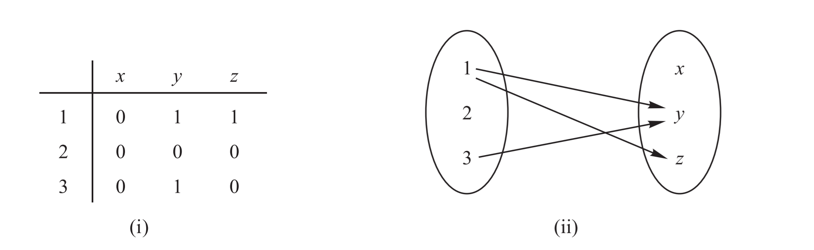
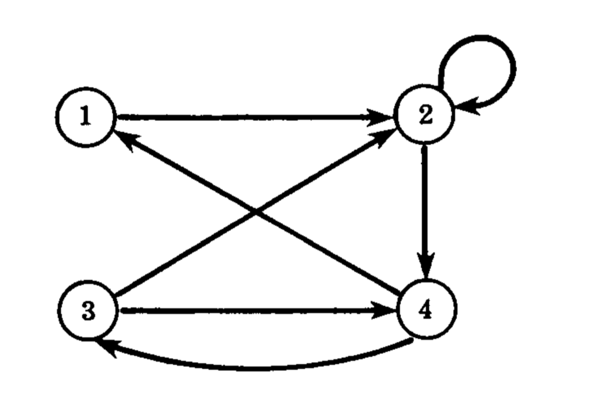

## 关系的图示

通常，一个关系由满足某给定方程

$$
E(x, y) = 0
$$
的有序实数偶构成。通常将该关系与这个方程等同。
称$E(x, y) = 0$ 为关系。

### 有限集上关系的图示

设A，B为有限集，下面给出图示A到B的关系R的两种方法。

  * 构造一个矩阵，以A的元素和B的元素分别标注其行与列，对于$a ∈ A$ 和 $b ∈ B$，视a，b是否具有关系R，在a行和b列交叉处标上1或0.
    这样得到的矩阵称为**关系矩阵**。
  * 在两个不相交的碟形区域中分别写下A和B的元素，当a，b具有关系R时，则画一个从a到b的箭头。
    这样得到的图示称为关系的**箭头图**。

### 集上关系的有向图

当R为有限集到自身的关系时，可以用另一种方法给出R的图示，先写下给定集合的元素，对于每一个元素x，如果x与元素y之间具有关系R，我们就画一个自x到y的箭头，这样得到的图形称为关系的**有向图**。

设 $R$ 是集合 A 上的关系, 从 $a$ 到 $b$ 存在一条长为 $n$ 的路径, 当且仅当
$$
(a,b)\in R^n
$$

## 关系的合成

设A，B，C为集合，且R为从A到B的一个关系，S为从B到C的一个关系，即R为A × B的子集，
则由R和S决定了从A到C的一个关系，记作 $R \circ S$。定义为：

$a(R \circ S)c$ 如果对于某b ∈ B 我们有$aRb$且$bSc$，

即

$$
R \circ S = \{(a, c)|\ \exist b \in B\quad Let (a, b) ∈ R\and(b, c) ∈ S\}
$$

### 关系的合成与矩阵

设 $M_R$ 和 $M_S$ 分别表示关系R和S的矩阵，则将 $M_R$ 与 $M_S$，得矩阵$M_{R \circ S} = M_R \cdot M_S$。
这个矩阵中的非零元素表示其所对应的元素具有关系。

### 定理2.1

设A，B，C，D为集合，假定R为从A到B的关系，S为从B到C的关系，T为从C到D的关系，则：

$$
(R \circ S) \circ T = R \circ (S \circ T)
$$

